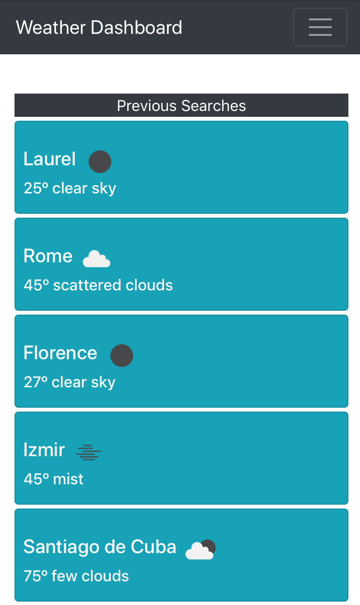

# weather-dashboard

## Description and Usage

Allowing app to access your location enables it to search for your current local weather and a five day forecast.  Search for any city in the world to see it's current conditions and forecast. Click on it's longitude and latitude coordinates to open a map of location in another browser. All past searches are saved and displayed showing current conditions updating every five minutes.  Click on a previous search to see its five day forecast!

## Credits

<ul>
<li>openweather.com API</li>
<li>Geolocation API</li>
<li>moment.js</li>
<li>jquery</li>
</ul>
